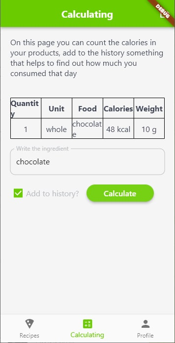
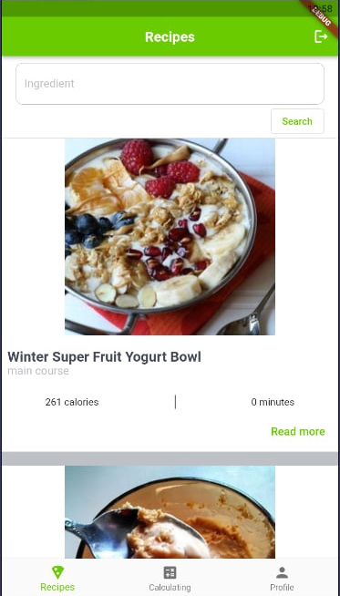
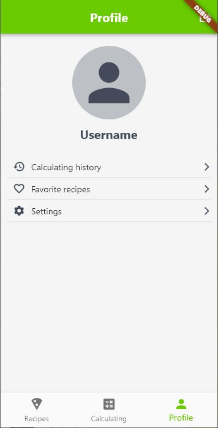

# Food Analyzator

It`s new project about food, calories and recipes. Connection with [edamam-API](https://www.edamam.com/) is already installed, which means that the application already has part of the functionality - searching for recipes by ingredient, nutrition analysis by ingredients

Also added connection to the Hive database and adding recipes to the favorites list, adding calculations to calculating history page

<h2 align="center">So, stand by new upgrates😉</h2>

## Screenshots

* **Auth page**

* **Nutrition analysis page**

* **Recipe page**

* **Recipe details page**

* **Profile page**

